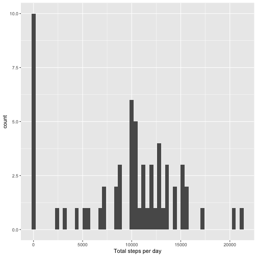
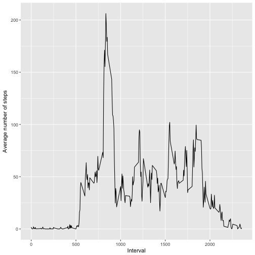
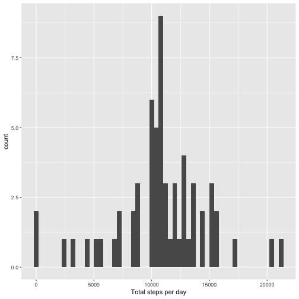
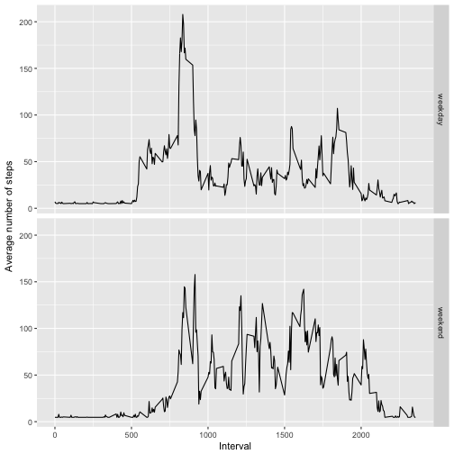

#Peer-graded Assignment


###Loading and preprocessing the data

1. Load data  


```r
data <- read.csv("activity.csv", header = TRUE, stringsAsFactors = FALSE)
```
###Mean total number of steps taken per day

1. Calculate the total number of steps taken per day

```r
stepsPerDay <- tapply(data$steps, data$date, sum, na.rm=TRUE)
```
2. Make a histogram of the total number of steps taken each day

```r
qplot(stepsPerDay, xlab = "Total steps per day", binwidth = 400)
```



3. Mean and median number of steps taken each day

```r
daysMean <- mean(stepsPerDay)
daysMedian <- median(stepsPerDay)
```
Mean of the total number of steps taken per day: **9354.2295082**  
Median of the total number of steps taken per day: **10395**

###The average daily activity pattern
1. Make a time series plot

```r
intervalMean <- aggregate(data$steps, by = list(interval=data$interval), FUN = mean, na.rm = TRUE)
ggplot(intervalMean, aes(interval, x)) + geom_line() +
  xlab("Interval") + ylab("Average number of steps")
```



2. The 5-minute interval that, on average, contains the maximum number of steps

```r
index <- which.max(intervalMean$x)
maxSteps <- intervalMean[index, "interval"]
```
**835** interval contains the maximum number of steps

###Imputing missing values 
1. Calculate and report the total number of missing values in the dataset

```r
totalNAs <- length(which(is.na(data$steps)))
```

2. Create a new dataset that is equal to the original dataset but with the missing data filled in.

```r
dataCopy <- data
```

3. Devise a strategy for filling in all of the missing values in the dataset. The strategy does not need to be sophisticated.

```r
dataCopy$steps[is.na(dataCopy$steps)] <- mean(dataCopy$steps, na.rm = T)
```

4. Make a histogram of the total number of steps taken each day  

```r
stepsPerDayFilled <- tapply(dataCopy$steps, dataCopy$date, sum)
qplot(stepsPerDayFilled, xlab = "Total steps per day", binwidth = 400)
```



5. Report the mean and median

```r
daysMeanNew <- mean(stepsPerDay)
daysMedianNew <- median(stepsPerDay)
```
Mean of the total number of steps taken per day: **9354.2295082**  
Median of the total number of steps taken per day: **10395**


###Are there differences in activity patterns between weekdays and weekends?

1. Create a new factor variable in the dataset with two levels – "weekday"" and "weekend"

```r
dataCopy$weekdays <- weekdays(as.Date(dataCopy$date))
dataCopy$dayType[dataCopy$weekdays == "Saturday" | dataCopy$weekdays == "Sunday"] <- "weekend"
dataCopy$dayType[!(dataCopy$weekdays == "Saturday" | dataCopy$weekdays == "Sunday")] <- "weekday"
```
2. Make a panel plot containing a time series plot (i.e. 𝚝𝚢𝚙𝚎 = "𝚕") of the 5-minute interval (x-axis) and the average number of steps taken, averaged across all weekday days or weekend days (y-axis)

```r
meanbyweekday <- aggregate(x = list(steps=dataCopy$steps), by = list(interval=dataCopy$interval, dayType=dataCopy$dayType), FUN = mean, na.rm = TRUE)
#meanbyweekday <- aggregate(steps ~ interval + dayType, data=dataCopy, mean)
ggplot(meanbyweekday, aes(interval, steps)) + 
    geom_line() + 
    facet_grid(dayType ~ .) +
    xlab("Interval") + 
    ylab("Average number of steps")
```


